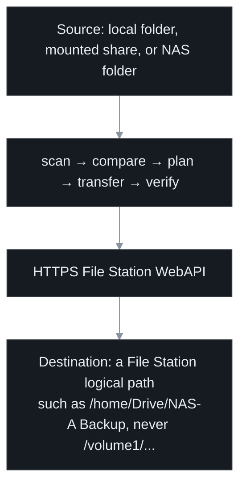

# synology-drive-sync

[](https://github.com/supermarsx/synology-drive-sync/actions/workflows/ci.yml)
[](https://github.com/supermarsx/synology-drive-sync/actions/workflows/docs.yml)
[](https://github.com/supermarsx/synology-drive-sync/actions/workflows/release.yml)
[](https://github.com/supermarsx/synology-drive-sync/actions/workflows/security.yml)
[](https://github.com/supermarsx/synology-drive-sync/releases/latest)
[](https://github.com/supermarsx/synology-drive-sync/blob/main/license.md)
[](https://github.com/supermarsx/synology-drive-sync/blob/main/Cargo.toml)
[](https://supermarsx.github.io/synology-drive-sync/installation.html)

`synology-drive-sync` is a finite, one-way synchronization engine. It sends an ordinary readable
folder to a chosen Synology File Station path over HTTPS, verifies the result, logs out, and exits.
The authoritative source is opened read-only and is never intentionally changed.



It is not a private Synology Drive protocol client. It writes through File Station; Synology Drive
can index the result when the destination belongs to the remote account's My Drive or an enabled
Team Folder.

**Documentation:** [install, configure, operate, integrate, and verify releases](https://supermarsx.github.io/synology-drive-sync/)

## Experimental software

> [!WARNING]
> This is young software. The repository dates from August 2026, releases land days apart, and it
> has been exercised by very few people against very few NAS models and DSM builds. Nothing here
> has the operational history that would let anyone call it proven.

It is built and tested deliberately: over 600 Rust tests and more than 250 dashboard tests, line
coverage enforced as a CI gate, and releases published with `SHA256SUMS` and artifact attestation.
Careful is not the same as proven. One day of testing against a single real NAS was enough to
surface a TLS provider that blocked for over an hour on a low-entropy system, diagnostics that
reported success while silently skipping the thing they were meant to check, and a dashboard that
could describe an operation's outcome as unknown when it had never been accepted. Those are fixed,
but they are all the same kind of fault: behaviour that appears only on a device nobody has tried
yet, which is exactly what a small pool of test hardware cannot rule out.

So use it, but verify it yourself: read [`security.md`](https://github.com/supermarsx/synology-drive-sync/blob/main/security.md)
before storing credentials, treat the warnings in [Safety first](#safety-first) as literal, and
complete the acceptance runbook against a disposable destination before pointing it at anything you
would miss.

## Contents

- [Experimental software](#experimental-software)
- [What it does](#what-it-does)
- [What it is for](#what-it-is-for)
- [Choose how to run it](#choose-how-to-run-it)
- [Safety first](#safety-first)
- [Operations and comparison modes](#operations-and-comparison-modes)
- [Five-step quick start](#five-step-quick-start)
- [What a run looks like](#what-a-run-looks-like)
- [Profiles, batches, and unattended runs](#profiles-batches-and-unattended-runs)
- [Requirements and deliberate limitations](#requirements-and-deliberate-limitations)
- [Releases, integration, and further documentation](#releases-integration-and-further-documentation)

## What it does

Each run scans both sides, creates missing directories, uploads missing or changed files, preserves
empty directories, verifies transfers, and finishes with a fresh plan. Remote-only entries are
preserved by default. Content correspondence is rebuilt from live state on every run.

The destination is a File Station logical path such as `/home/Drive/NAS-A Backup` or
`/TeamShare/Project`, never a DSM filesystem path such as `/volume1/...`. DSM must already provide
the account, File Station access, user-home or shared-folder root, and permissions. The sync may
create descendants beneath an existing writable parent, but it cannot create DSM users or shares,
enable User Home or Team Folders, or change ACLs.

## What it is for

Each of these assumes one authoritative copy on the source side and a File Station destination the
account already has access to.

- **A workstation publishing finished work to a NAS share.** A Windows, macOS, or Linux machine
  holds the working copy and a scheduled `sync` pushes it to a File Station path, so the NAS always
  carries the current state. The password lives in Windows Credential Manager, macOS Keychain, or
  Linux Secret Service rather than in a script, and Windows Task Scheduler, cron, systemd, or a
  LaunchAgent starts the finite run.
- **One Synology pushing to another.** The DSM 7 package runs on the NAS that holds the
  authoritative folder and sends it over HTTPS to a File Station path on a second Synology.
  Interval and daily routines cover a schedule; a realtime routine watches with `inotify`, falls
  back to polling, and launches a finite run after a debounce.
- **Getting a folder into Synology Drive without speaking Drive's protocol.** Point the destination
  at a path under the remote account's My Drive or an enabled Team Folder and Drive indexes what
  File Station wrote, so the result reaches Drive clients without this tool implementing anything
  Drive-specific.
- **A pipeline publishing build output.** The container runs non-root with every capability
  dropped, a read-only root filesystem, a read-only bind mount of the source, and the password
  passed as a file rather than an environment variable; it exits when the work is done.
  `--output json` or `--output ndjson` feeds a log collector, and `plan --exit-code` returns `10`
  when changes are pending, which makes it usable as a CI or health check.
- **An application that needs the engine in-process.** Rust callers use the synchronous
  `synology_drive_sync::sdk::Engine`; other languages use the versioned JSON-over-C ABI. Secrets,
  cancellation, and process policy stay with the caller.

### Where it is not the right tool

Synchronisation is not backup. It sends the current state one way and keeps no history of what it
replaced, so a local file that is corrupted or encrypted in place is exactly what the next run
uploads over the good remote copy. With mirror deletion enabled, a local deletion removes the remote
file too. Keep separate, tested recovery; see [Safety first](#safety-first). It does not reconcile
in two directions either: an edit made on the NAS is never brought back, and the next local change
to that path overwrites it. It is not a Synology Drive client, so there is no Drive conflict
protocol and no on-demand or selective sync. And it carries content, hierarchy, names, and file
mtime only; ACLs, ownership, modes, and extended attributes are not preserved.

## Choose how to run it

| Surface | Best fit | Runtime model |
| --- | --- | --- |
| Native CLI | A source on Windows, macOS, Linux, or an OS-mounted network share | One explicit finite process; run manually or with the native scheduler |
| DSM 7 package and dashboard | The authoritative source is physically available to a Synology NAS | Non-root package service, graphical profiles and diagnostics, and interval/daily/realtime routines |
| Docker / Compose | A portable, isolated unattended job | Non-root finite container with a read-only source mount |
| Rust SDK or C ABI | Another application needs to embed the engine | Synchronous library call with caller-owned secrets, cancellation, and process policy |

The core binary is not a resident watcher. In **realtime** routine mode, the DSM package controller
can watch with `inotify` or fall back to polling, then launch a finite plan or sync after debounce.
Interval and daily routines also launch finite runs. The dashboard and the
`sdsync-dsm` recovery/automation manager operate the same package-owned profiles, credentials,
routines, state, and logs.

## Safety first

> [!WARNING]
> Synchronization is not backup. Even additive sync may replace a same-path remote file when the
> local file changed. Keep independent, tested recovery that this tool cannot overwrite.

> [!CAUTION]
> Mirror deletion can be enabled by the effective CLI, environment, or profile configuration and
> must also pass every applicable batch, scheduler, or DSM authorization layer. Deletion and remote
> type replacement are guarded, but they are not transactional or crash-atomic. Review `plan`, use
> deliberately small caps, keep both trees quiescent, and test recovery before enabling deletion.

> [!IMPORTANT]
> Automated tests use local filesystems and mock HTTP services; they do not log in to a live NAS.
> Before trusting production data, complete the
> [disposable live-NAS acceptance and recovery runbook](https://supermarsx.github.io/synology-drive-sync/production-acceptance.html)
> against the exact NAS, DSM build, reverse proxy, account, source, and scheduler identity you will
> use.

## Operations and comparison modes

| Operation | Remote effect | Use it for |
| --- | --- | --- |
| `doctor source [SOURCE] [--hash]` | None | Validate readability, names, exclusions, and optionally every payload fingerprint |
| `doctor --level quick target [REMOTE]` | None | Check TLS, reverse-proxy routing, and API discovery without authenticating |
| `doctor target [REMOTE]` | None | Run the default Standard check: authenticate, then sample at most five visible share roots when no destination is selected or five direct children when one is selected, and log out |
| `doctor --level extensive target [REMOTE]` | None | Require the fullest target API/capability evidence; still read-only |
| `doctor --level extensive target [REMOTE] --write-test` | Disposable probe and cleanup only | Exercise live create, upload, copy, MD5/CRC32/SHA-256 verification, and cleanup |
| `plan` | None | Review the exact pending work; `--exit-code` returns `10` when changes exist |
| `sync` | Creates and updates | Safe default; remote-only entries remain |
| `sync` with effective deletion enabled | Creates, updates, and guarded removals | Deliberate one-way mirror after separate recovery testing |

Every target level reports an overall verdict plus timed, per-section `PASS`, `WARN`, `FAIL`, or
`SKIP` evidence. A bare Standard or Extensive target Doctor authenticates and reports no more than
five File Station-reported shared-folder roots under `visible_shared_folders`; it never chooses one
or treats discovery as proof of browse/read/write permission
for the user. Supplying `REMOTE`, directly or through a profile, instead reports at most five
non-recursive folder/file entries under `direct_children`. An empty sample is retained as explicit
evidence. Extensive never writes unless the separate `--write-test` opt-in is present. See
[Diagnostics and multi-profile batches](https://supermarsx.github.io/synology-drive-sync/diagnostics-and-batch.html)
for the exact checks, bounds, and limitations.

Comparison is independent of the operation:

| Mode | A same-path file matches when | Trade-off |
| --- | --- | --- |
| `content` | Size, MD5, IEEE CRC32, SHA-256, and one-second mtime match | Safest and default; streams selected remote bytes and verifies uploads |
| `metadata` | Size and one-second mtime match | Faster, but can miss equal-size/equal-time content changes |
| `size-only` | Size matches | Fastest and weakest; no content verification |

Use `--no-delete` to defeat deletion selected by a profile or environment for one invocation. A
mirror additionally enforces destination containment, per-profile and aggregate deletion caps,
empty-source protection, managed-path and remote-mount boundaries, fresh remote snapshots, and
failure-before-delete ordering.

## Five-step quick start

1. **Install a verified release.** Download and inspect the supplied installer. It selects the
   native archive, verifies `SHA256SUMS`, checks the embedded version, and installs the executable.
   Windows, manual archives, DSM packages, containers, and provenance are covered in the
   [installation guide](https://supermarsx.github.io/synology-drive-sync/installation.html).

   ```bash
   curl --proto '=https' --tlsv1.2 -fL \
     https://github.com/supermarsx/synology-drive-sync/releases/latest/download/install.sh \
     -o install.sh
   less install.sh
   sh install.sh
   ```

2. **Prepare DSM.** Use a dedicated non-administrator account with File Station application
   permission and read/write access to the destination. Route the configured HTTPS origin to
   `/webapi/entry.cgi`; do not use a browser alias or physical `/volumeN` path.

3. **Store the password outside command history and TOML.** The native CLI can use the current
   user's Windows Credential Manager, macOS Keychain, or Linux Secret Service vault.

   ```bash
   synology-drive-sync credentials set-password \
     --url https://files.example.com --username mirror-bot
   ```

4. **Diagnose and plan without changing the destination.** Add `--hash` to the separate source
   diagnostic when you want every local payload read and fingerprinted. Target Doctor defaults to
   Standard and remains non-mutating.

   ```bash
   synology-drive-sync doctor source ./project --hash
   synology-drive-sync doctor --url https://files.example.com --username mirror-bot \
     --level standard target /TeamShare/project
   synology-drive-sync plan ./project /TeamShare/project \
     --url https://files.example.com --username mirror-bot
   ```

5. **Run the additive sync.** Keep deletion disabled through initial acceptance.

   ```bash
   synology-drive-sync sync ./project /TeamShare/project \
     --url https://files.example.com --username mirror-bot
   ```

## What a run looks like

### Native CLI

Target Doctor prints the build that produced the report, an overall verdict, then one line per
section carrying the step at which that section actually ran, its elapsed time, and its evidence.
Every DSM request a section made is listed beneath it; the sample below keeps the transport and
session requests and drops the rest to stay readable. The host, account, and paths are fictional,
and the report never prints a password, one-time code, session identifier, or SynoToken, because no
field in it is capable of holding one.

```text
$ synology-drive-sync doctor --url https://nas.example.com --username mirror-bot \
    --level standard target /home/Backup/project
synology-drive-sync 26.38 (ae75b0f) x86_64-unknown-linux-gnu
Doctor standard: PASS
  [PASS] step 1/16 Network reachability and connect timing (37 ms): TCP reachability is consistent: connect min 1.8 ms / median 2.0 ms / max 2.4 ms over 3 samples
  [PASS] step 2/16 Routing and TLS negotiation (181 ms shared with routing and discovery): HTTPS route and TLS negotiation succeeded with certificate verification enabled
  [PASS] step 3/16 DSM API discovery (181 ms shared with routing and discovery): DSM Auth and baseline File Station API versions were validated from the discovery response
           #1 SYNO.API.Info.query v1 session=none -> ok http 200 in 181 ms
  [PASS] step 4/16 DSM capability enumeration (96 ms): DSM advertises 214 APIs; all 10 APIs this tool uses are present with compatible versions
  [PASS] step 15/16 Intermediaries and reverse proxies (no request of its own; summarised from the requests other sections made): no proxy, relay, or cache announced itself on any response
  [PASS] step 6/16 DSM session authentication (407 ms): DSM credentials were accepted and an authenticated File Station session was established
           #3 SYNO.API.Auth.login v6 session=none -> ok http 200 in 402 ms
  [PASS] step 7/16 DSM session channel ablation (311 ms): the session is accepted both as this client normally presents it and through the documented _sid request field alone; the synthesised cookie alone was also accepted. Channel selection is not the fault here
           #4 SYNO.FileStation.List.list_share v2 session=cookie+token-header+sid-field+token-field -> ok http 200 in 88 ms
           #5 SYNO.FileStation.List.list_share v2 session=sid-field -> ok http 200 in 74 ms
           #6 SYNO.FileStation.List.list_share v2 session=cookie -> ok http 200 in 71 ms
           #7 SYNO.FileStation.List.list_share v2 session=token-header -> dsm-error http 200 dsm 119 in 69 ms
  [SKIP] step 8/16 Concurrent session fan-out (0 ms): the concurrent fan-out probe runs at the extensive level only
  [PASS] step 16/16 Session cookie permanence (no request of its own; summarised from the requests other sections made): 1 cookie name(s) were set and none was re-issued under a changed value on a successful call
  [PASS] step 5/16 File Station capabilities (no request; answered from the discovery response): the APIs required by the selected quick or standard diagnostic are available
  [PASS] step 9/16 File Station capability diagnosis (298 ms): all 4 probed capabilities work for this account
  [PASS] step 10/16 Destination path resolution (no request of its own; summarised from the requests other sections made): all 3 components of the destination exist and are directories
  [PASS] step 11/16 Destination permissions (146 ms): the authenticated account can create a child in the exact destination
  [PASS] step 12/16 Destination inventory (129 ms): one direct-child page was inspected without recursion; 24 total entries, 5 sampled, 19 truncated
  [SKIP] step 13/16 Disposable write, verify, and cleanup (0 ms): not requested; remote mutation requires the separate --write-test opt-in
  [PASS] step 14/16 DSM session logout (58 ms): the authenticated DSM session was closed
... trimmed here: the reachability, intermediary, cookie-ledger, capability, and path-resolution
    evidence blocks, and the bounded remote-inventory sample ...
Doctor: routing, API discovery, authentication, and remote access are healthy (24 direct entries; destination exists; write permission checked at the exact destination /home/Backup/project).
```

A `WARN` or `FAIL` section adds an indented `hint:` line naming the next step. The same report is
available as `--output json` or `--output ndjson` under the `sdsync.doctor.v1` schema.

The source diagnostic and `plan` are terser. Neither contacts the destination for a mutation, and
`plan` is the exact work `sync` would perform:

```text
$ synology-drive-sync doctor source /srv/project
Source is healthy: 218 files, 24 directories, 486.3 MiB across 242 entries; 0 files hashed in 96 ms (/srv/project).

$ synology-drive-sync plan /srv/project /home/Backup/project \
    --url https://nas.example.com --username mirror-bot
Plan: 3 uploads (12.4 MiB), 0 server copies (verified upload fallback up to 0 B), 1 directories, 0 deletions, 215 unchanged files, 6 protected remote entries.
  MKDIR  /home/Backup/project/reports/2026-q3 (missing-remote: no remote entry at this path)
  UPLOAD reports/2026-q3/summary.pdf -> /home/Backup/project/reports/2026-q3/summary.pdf (missing-remote: no remote entry at this path)
  UPLOAD notes/decisions.md -> /home/Backup/project/notes/decisions.md (content-differs: size equal, complete MD5/CRC32/SHA-256 fingerprint did not match)
  UPLOAD notes/todo.md -> /home/Backup/project/notes/todo.md (mtime-differs: size equal, modification time differs)
Plan only; no remote changes were made.
```

The same run as `sync` closes with `Sync complete: 3 uploaded (12.4 MiB), 0 copied on NAS, 1
directories created, 0 remote entries deleted in 8420 ms.`

### DSM 7 package dashboard

The DSM package is a native AppWindow rather than a terminal, so there is nothing to paste and no
screenshot here. This is a sketch of the Overview page and the navigation the package registers:

```text
+--------------------+---------------------------------------------------------+
| Drive Sync         | Overview           Updated 09:41:12    Autosave ready   |
| File Station sync  |                                    [ Help ]  [ Refresh ]|
+--------------------+---------------------------------------------------------+
| > Overview         | Service  running                                        |
|   Profiles         | [ Plan all profiles ]   [ Run all profiles ]            |
|   Routines         |                                                         |
|   Health / Doctor  | Profiles      2        Next routine   8 Sep 2026, 23:00 |
|   Activity / Logs  | Last result   success  Active scope   Idle              |
|   Notifications    | Realtime      Off                                       |
|   Security         |                                                         |
|   Settings         | Profile readiness         | Last operation              |
|   About            | office_nas   Credential   | Operation  sync             |
|                    |   /home/Backup/office     | State      success          |
| * Authenticated    | photos     Needs password | Scope      all profiles     |
|   package bridge   |   /TeamShare/Photos       | Finished   8 Sep 2026, 09:38|
+--------------------+---------------------------------------------------------+
```

What each page is for: **Profiles** edits a source, endpoint, account, destination, comparison
mode, and a separate deletion guard, with NAS and File Station folder browsers and password, TOTP,
and remote-log-token fields that store masked and are never read back. **Routines** attaches
interval, daily, or realtime automation per profile, with debounce, poll fallback, retry backoff,
active weekdays, and its own deletion-approval ceiling. **Health / Doctor** runs the target
diagnostic above at a chosen depth, keeps the section evidence and a per-profile cached view of
reachability, writability, latency, and free space, and can copy the whole report. **Activity /
Logs** is the structured event stream with bounded package logs. **Notifications** sets DSM desktop
alerts and their failure thresholds and cooldown. **Security**, **Settings**, and **About** hold
package policy, interface preferences, and build identity. Valid edits autosave, and the window
stays read-only until the authenticated DSM bridge is available.

## Profiles, batches, and unattended runs

Named TOML profiles keep a complete source, endpoint, account, destination, and non-secret policy.
CLI values override environment values, which override the selected profile and built-in defaults.
The schema accepts protected secret-file paths but never password, TOTP seed, current OTP, or bearer
token values.

```bash
synology-drive-sync config init
synology-drive-sync plan --profiles photos,documents --output json
synology-drive-sync sync --all-profiles --max-total-delete 20 --output ndjson
```

A batch preflights every source and target before its first mutation, then runs profiles in name
order. Completed earlier jobs are not rolled back when a later job fails.

For unattended operation, choose systemd, cron, LaunchAgent, Windows Task Scheduler,
Docker/Compose, or DSM routines. Validate source and secret access under the eventual identity,
prevent overlap, and allow enough time for the complete scan-transfer-verify workload.

## Requirements and deliberate limitations

- The one configured endpoint must use HTTPS by default and route the File Station WebAPI. Use a
  private CA certificate when needed; insecure HTTP or certificate bypasses are for controlled
  testing only. QuickConnect is not supported—use LAN, DDNS, VPN, or a tested reverse proxy.
- Passwords and supported authenticator-app TOTP can come from an OS vault, protected files,
  standard input, prompts, or dedicated environment variables. DSM Secure SignIn approval and
  hardware/security-key challenges are not supported by the documented File Station login flow.
- Sources may be local directories, mounted SMB/CIFS/NFS folders, mapped-drive subdirectories, or
  ordinary Windows UNC share roots such as `\\nas\media`. Filesystem roots (`/`, `C:\`), mapped-drive
  roots such as `Z:\`, and Windows administrative shares such as `C$`, `ADMIN$`, and `IPC$` are
  rejected. The operating system remains responsible for mounting and source-share authentication.
- Symlinks, junctions/reparse points, special or unreadable entries, unsafe names, and case
  collisions fail closed. Keep the source quiescent and run as an unprivileged identity that owns
  or exclusively controls it.
- There is no two-way reconciliation, Drive conflict protocol, block-level delta, resumable upload,
  transactional multi-profile rollback, or crash-atomic overwrite/type replacement.
- File content, hierarchy, names, and file mtime are in scope. ACLs, ownership, modes, xattrs, hard
  links, sparse layout, and directory mtime are not preserved. Different URLs that reach the same
  NAS are aliases the client cannot identify.

## Releases, integration, and further documentation

Calendar releases use `YY.N` tags. They publish native CLI archives for Linux, Windows, and macOS on
x86-64 and ARM64; DSM 7 SPKs for `x86_64`, `armv8`, ARMv7, and Evansport `i686`; Linux container
images for AMD64 and ARM64; and matching Rust and C SDK material. The
[release selector](https://supermarsx.github.io/synology-drive-sync/release-selector.html) matches a
payload to an exact NAS model, DSM build, and CPU. Verify the selected payload against `SHA256SUMS`
and, when publisher provenance matters, its GitHub artifact attestation.

Rust applications can pin the high-level synchronous `synology_drive_sync::sdk::Engine` to an exact
verified release tag. Non-Rust applications use the versioned JSON-over-C ABI only with the header
and DLL, `.so`, or `.dylib` from the same release SDK. See the
[Rust SDK guide](https://supermarsx.github.io/synology-drive-sync/sdk/index.html) and
[C ABI guide](https://supermarsx.github.io/synology-drive-sync/ffi/index.html).

| Task | Guide |
| --- | --- |
| Understand the safety model and first run | [Overview](https://supermarsx.github.io/synology-drive-sync/getting-started/overview.html) · [Quick start](https://supermarsx.github.io/synology-drive-sync/getting-started/quick-start.html) |
| Configure profiles, secrets, TLS, comparison, and deletion | [Configuration](https://supermarsx.github.io/synology-drive-sync/configuration/index.html) |
| Install and operate the DSM dashboard | [Synology package](https://supermarsx.github.io/synology-drive-sync/synology-package.html) |
| Schedule and monitor unattended jobs | [Scheduling](https://supermarsx.github.io/synology-drive-sync/operations/scheduling.html) · [Observability](https://supermarsx.github.io/synology-drive-sync/observability.html) |
| Diagnose failures and complete live acceptance | [Troubleshooting](https://supermarsx.github.io/synology-drive-sync/operations/troubleshooting.html) · [Acceptance runbook](https://supermarsx.github.io/synology-drive-sync/production-acceptance.html) |
| Inspect commands and release evidence | [CLI reference](https://supermarsx.github.io/synology-drive-sync/reference/cli.html) · [Release verification](https://supermarsx.github.io/synology-drive-sync/releases.html) |

### Development

```bash
cargo fmt --all -- --check
cargo clippy --locked --workspace --all-targets --all-features -- -D warnings
cargo test --locked --workspace --all-targets
cargo build --release --locked -p synology-drive-sync
cargo build --profile ffi-release --locked -p synology-drive-sync-ffi
```

See [testing](https://supermarsx.github.io/synology-drive-sync/testing.html),
[security](https://supermarsx.github.io/synology-drive-sync/security.html), and
[contributing](https://supermarsx.github.io/synology-drive-sync/contributing.html). The project is
[MIT licensed](https://supermarsx.github.io/synology-drive-sync/legal.html).
